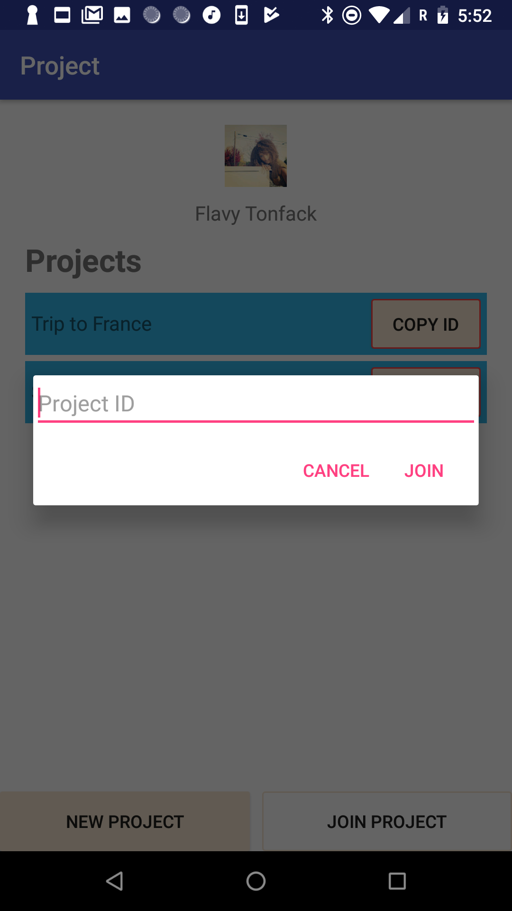

# Android-App

# What is Group Project?
Group Project is an Android App that allows user to create
multiple projects. Member of the group can add people to the
project using an unique ID, assign task to each member of the
group, member can claim task(s) that they are interested in
and mark as completed when they are done.

# Screenshots

